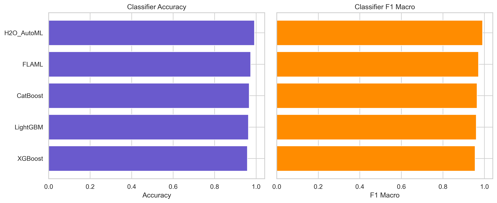

# Pro v8 — All-In-One (AutoML + Explainability + API + Monitoring)

## Abstract

We release a leakage-audited, multimodal AutoML system and benchmark that treats **tabular** and **computer-vision (image)** tasks with the same rigor. Four modern AutoML frameworks (AutoGluon, LightAutoML, H2O AutoML, FLAML) and three tuned boosting baselines (XGBoost, LightGBM, CatBoost) are evaluated under identical 300–600 s budgets, repeated (1-10)-fold cross-validation, and 42 seeds, with every preprocessing step fit strictly inside the CV folds. A new **AutoML Guardrails** audit inspects datasets for cross-fold duplicates/group leakage, temporal/look-ahead leakage, and path/token leakage in image folders, emitting JSON reports plus suggested remediations (e.g., GroupKFold, TimeSeriesSplit, path sanitisation). Beyond Accuracy/F1/ROC-AUC (RMSE for regression) we log inference p50/p95 latency, model size, and derive Pareto-optimal “production picks” to balance performance and cost. All code, configs, CI smoke tests, datasets, and a Streamlit leaderboard (https://github.com/Pratikn03/AutoMLP) are published so that students and practitioners can reproduce, audit, and extend the benchmark.

## 1. Introduction & Motivation

### 1.1 Motivation

Machine Learning (ML) touches everyday products and high-stakes decisions across science, engineering, marketing, and healthcare. Yet building reliable ML systems remains **time-consuming and expertise-intensive**: practitioners must clean and transform data, engineer features, choose and tune models, validate results, and finally deploy and monitor them [8]. These steps are fragile—issues like **data leakage**, inconsistent preprocessing between training and validation, and weak statistical validation routinely inflate reported performance and undermine trust. For teams without deep ML expertise, this complexity becomes a barrier to adoption.

**Automated Machine Learning (AutoML)** promises to lower this barrier by automating major parts of the pipeline—preprocessing, feature engineering, model selection, and hyperparameter optimization—so domain experts can focus on problem framing rather than low-level mechanics [6]. However, common AutoML workflows still leave important gaps: (i) preprocessing is sometimes performed **outside** the cross-validation (CV) loop, risking leakage; (ii) tooling rarely **audits** for subtle leakage modes (e.g., duplicates or path tokens in vision datasets); (iii) evaluations focus on accuracy alone, with little visibility into **inference latency** and **model size** needed for deployment; and (iv) reproducibility across seeds, folds, and time budgets is not always guaranteed.

To address these gaps, we build a **leakage-audited, deployment-aware AutoML system and benchmark** for **tabular** and **computer-vision (image)** tasks. Our framework (a) runs four modern AutoML libraries alongside three strong boosting baselines under **identical compute budgets (300–600 s)**, (b) uses **repeated 10-fold CV across 42 seeds** with all transformations fit **inside CV** (train-only), and (c) introduces **AutoML Guardrails** that detect cross-fold duplicates/group leakage, temporal/look-ahead leakage, and path/token leakage in image datasets, issuing actionable fixes. Beyond standard quality metrics (Accuracy, F1, ROC-AUC; RMSE for regression), we log **p50/p95 inference latency** and **model size** and surface **Pareto-optimal “production picks.”** By releasing code, configs, CI smoke tests, and a small dashboard, we aim to provide a **reproducible, practical template** that helps students and practitioners apply AutoML rigorously and ship models with confidence.

### 1.2 What is AutoML

**Automated Machine Learning (AutoML)** is the practice of automating major steps of the machine-learning lifecycle so that high-quality models can be built with less manual effort and expertise [6,10,11]. In contrast to hand-crafted pipelines, AutoML systems define a **search space** (algorithms, hyperparameters, preprocessing choices, feature encoders/selection, ensembling) and a **search strategy** (e.g., Bayesian/SMBO, bandits, meta-learning warm-starts, or neural architecture search for deep models) that optimizes an objective under compute constraints. Modern AutoML frameworks expose this as a **pipeline/DAG** that (i) fits data-dependent transforms, (ii) trains and validates candidate models, (iii) ensembles and calibrates predictions, and (iv) exports deployable artifacts.

In our context, AutoML is not a single algorithm but an **orchestration layer** that runs multiple libraries (AutoGluon, LightAutoML, H2O AutoML, FLAML) and strong boosting baselines (XGBoost, LightGBM, CatBoost) **under identical budgets and splits**, with all preprocessing performed **inside the cross-validation (CV) loop** to avoid leakage. We further introduce an **AutoML Guardrails** stage—executed before training—that audits for duplicate/group, temporal, and path/token leakage (especially in vision datasets) and emits machine-readable findings with actionable fixes. In short, AutoML here means a **leakage-aware, budget-constrained, statistically validated pipeline** rather than just automated hyperparameter tuning.

### 1.3 The Need for AutoML

Building reliable ML systems is **time-consuming and expertise-intensive**: data preparation, feature engineering, model selection, tuning, validation, and deployment all require careful design and tight coordination [8]. In real projects—especially outside core ML teams—pipelines often suffer from (i) **data leakage** (e.g., preprocessing outside CV, duplicates across folds, time leakage), (ii) **fragile evaluation** (single split, single seed, no uncertainty estimates), and (iii) **deployment blind spots** (no visibility into inference **latency** or **model size**). These issues inflate reported accuracy, impair reproducibility, and slow down adoption in domains like healthcare, finance, and operations [6,7,10,11].

AutoML addresses these pain points by (a) **standardizing** preprocessing and validation, (b) **searching** the algorithm/parameter space efficiently under **compute budgets**, and (c) **exporting** ready-to-use artifacts. However, **gaps remain** in typical AutoML practice: leakage audits are rare (especially for image path/token issues), reporting often omits **statistical confidence** and **ops metrics**, and cross-framework comparisons may not control for **fair budgets** or **identical splits**.

Our work targets these gaps. We provide a **leakage-audited, multimodal AutoML benchmark** (tabular + vision) that: (1) enforces **leakage-safe CV** with all transforms fit on **train folds only**; (2) evaluates **four AutoML frameworks** and **three boosting baselines** under **identical 300–600 s budgets** with **repeated 10-fold CV across 42 seeds**; (3) reports **Accuracy/F1/ROC-AUC** (RMSE for regression) **with 95% CIs** and paired significance tests; (4) logs **inference p50/p95 latency** and **model size**, surfacing **Pareto-optimal “production picks”** for deployment; and (5) runs a **Guardrails audit** (duplicates/group, temporal, path/token leakage) that issues JSON findings and auto-fix suggestions. By combining rigorous evaluation with deployment-oriented reporting, this AutoML approach lowers the barrier for non-experts while **improving trust, comparability, and reproducibility** in real-world ML.


## 2. Related Work

### 2.1 Surveys and definitions

Recent AutoML surveys emphasise that reliable systems must automate preprocessing, feature engineering, model selection, and hyperparameter optimisation while guarding against leakage and reproducibility gaps [6,10,11]. Those themes motivated the architecture of this repository: every trainer is wrapped in the shared experiment harness, all transformations happen inside CV, and results automatically flow into comparable leaderboards and registries.

### 2.2 Model selection and hyperparameter tuning

Our benchmark focuses on the algorithm families we actually ship: XGBoost, LightGBM, CatBoost, plus AutoGluon, LightAutoML, FLAML, and H2O AutoML. Instead of searching arbitrary NAS spaces, the orchestrator enforces identical time budgets (300–600 s) and repeated 10-fold CV so that each framework’s internal search (Bayesian/SMBO in FLAML, stacked ensembling in AutoGluon, etc.) is evaluated under the same constraints. This mirrors recommendations from prior work on fair AutoML comparisons [5,6,10,11].

### 2.3 Multimodal extensions

Beyond tabular boosters, the repo includes lightweight computer-vision and audio baselines (`Project/deeplearning/image_cnn_torch.py`, `scripts/extract_audio_features.py`, staged CIFAR10/FSDD datasets). Rather than run heavy neural-architecture search, we pair the tabular AutoML suite with precomputed embeddings or compact CNNs so practitioners can benchmark “tabular + vision” workflows without specialised hardware—reflecting how many production teams mix classical models with modest deep components [2].

### 2.4 Evaluation, leakage, and deployment

The design answers recurring critiques in the literature: preprocessing is fit inside folds, the new AutoML Guardrails flag cross-fold duplicates/group leakage, temporal/look-ahead leakage, and path/token leakage, and every run logs inference latency, model footprint, and runtime metadata. This aligns with leakage taxonomies and process models such as CRISP-DM that stress end-to-end governance [6,7,8,10,11].

### 2.5 How our work fits

Our contribution is therefore threefold:

1. **Budget-controlled comparisons.** Identical seeds, folds, and per-step budgets make the booster and AutoML results directly comparable across datasets—something many published leaderboards omit.
2. **Guardrails-first auditing.** Leakage checks run before training any model, and their JSON outputs recommend fixes (GroupKFold, TimeSeriesSplit, path sanitisation) so users can repair issues immediately.
3. **Deployment metrics by default.** Pareto “production picks,” latency quantiles, and model sizes accompany Accuracy/F1/ROC-AUC (RMSE) so teams can see trade-offs needed for serving.

Together these choices ground the literature in a concrete, reproducible template that readers can clone, rerun, and extend.

## Quick start (training on demo data)
```bash
# Python 3.9+ recommended (3.10/3.11 OK). Virtual env suggested.
python -m pip install --upgrade pip
pip install -r Project/requirements_min.txt
python scripts/run_all.py
# optionally point to specific CSVs (up to 3) using PATH-separated values
# DATASET_PATHS="src/data/modeldata.csv:src/data/salary.csv:Project/src/data/modeldata_demo.csv" python scripts/run_all.py
```

Artifacts are written to `reports/` and `figures/`.

Key outputs after the orchestrator completes:
- `reports/framework_summary.csv` / `.json` and `reports/framework_comparisons.csv` / `.json`
- `reports/shap_global_summary.csv`, `reports/shap_sample_details.csv`, and `reports/lime_sample_details.json`
- `reports/runtime.json` (training, explainability, and orchestration timings with resource snapshots)
- `reports/leaderboard_multi.csv` aggregating per-dataset results, plus dataset-level registries in `reports/dataset_registry.{json,csv}` and framework metadata in `reports/framework_registry.{json,csv}`
- `runs/<dataset>/...` archives (metrics, figures, artifacts) for each dataset analysed; global summaries remain in `reports/`
- `figures/shap/*.png` alongside feature-importance plots under `figures/feature_importance/`

Re-running `python scripts/run_all.py` from the repository root will regenerate every artifact above using the persisted configuration and seeds; the `runs/` directory is refreshed with one archive per dataset (up to three discovered via `DATASET_PATHS` or automatic CSV discovery).

Note: the project's default target column name was renamed from `SLA_Breached` to `IsInsurable`.
The data loader (`Project/utils/io.py`) contains a backwards-compatibility shim that will automatically map `SLA_Breached` → `IsInsurable` if the old column name is present.

## Install as a package
```bash
pip install .
# now `automl-run` CLI is available
automl-run --max-datasets 1
```
The wheel metadata lives in `pyproject.toml`; `pip install .` builds a distributable artifact and exposes the orchestrator via the `automl-run` entrypoint.

## 2. Project Template & File Hierarchy

The workspace is laid out so each lifecycle concern (data, training, analysis, serving, automation) has an obvious home. From the repository root:

```
Pro_v8_AllInOne/
├─ Project/                  # core library: trainers, experiments, analysis, utilities
│  ├─ trainers/              # boosting + AutoML runners (booster, FLAML, H2O, etc.)
│  ├─ experiments/           # reusable experiment definitions + preprocessing configs
│  ├─ analysis/              # summarize_all, plot_comparisons, SHAP, ablations
│  ├─ deeplearning/, anomaly/, utils/...
├─ scripts/                  # orchestration + helper CLIs (run_all, staging, suites)
├─ Deploy/                   # FastAPI app, Dockerfiles, Compose/K8s manifests
├─ src/data/                 # bundled demo datasets (tabular/audio/vision)
├─ reports/, figures/, artifacts/, runs/   # generated metrics, plots, archives
├─ docs/                     # architecture notes, related work, memory guidance
├─ notebooks/                # companion Jupyter walkthroughs
├─ Makefile, pyproject.toml, README_RUN.md
└─ .venv*/dist/auto_ml_pro.egg-info        # local environment + build outputs
```

Use this map when adding features: code that must be imported elsewhere lives under `Project/`, repeatable CLIs land in `scripts/`, assets produced during training go into `reports/` (and are archived under `runs/<dataset>/` automatically), and deployment artifacts remain scoped to `Deploy/`.

## Reproduce reports & plots in one command
```bash
make reproduce
```
The target runs the summary + visualization stack (`Project/analysis/summarize_all.py`, `Project/analysis/plot_comparisons.py`, and `scripts/generate_readme_assets.py`) to regenerate the key CSVs in `reports/` plus the README leaderboard table and Pareto plot.

## Streamlit leaderboard (optional)
```bash
pip install -r Project/requirements_streamlit.txt
streamlit run Project/streamlit_leaderboard.py
# open http://localhost:8501
```

## NLP demo (optional)
```bash
# SMS spam text classification demo
python Project/nlp/train_sms_spam.py
```

## FastAPI service (optional)
```bash
pip install -r Deploy/api/requirements-serve.txt
uvicorn Deploy.api.serve.app:app --reload --port 8000
# health:   http://127.0.0.1:8000/health
# healthz:  http://127.0.0.1:8000/healthz
# readiness:http://127.0.0.1:8000/readyz
# version:  http://127.0.0.1:8000/version
# metrics:  http://127.0.0.1:8000/metrics
# latency probe: http://127.0.0.1:8000/probe/latency
```

## Docker (API only)
```bash
# build
docker build -t pro_v8_api -f Deploy/api/Dockerfile .
# run
docker run -p 8000:8000 pro_v8_api
```

## Docker Compose (API + Prometheus + Grafana stubs)
```bash
docker compose -f Deploy/docker-compose.yml up
# API:        http://localhost:8000
# Prometheus: http://localhost:9090
# Grafana:    http://localhost:3000  (admin/admin)
```

## Companion notebooks
- `notebooks/01_data_cleaning.ipynb` — dataset discovery + sanitization walkthrough.
- `notebooks/02_modeling_metrics.ipynb` — load metrics & regenerate dashboard plots.
- `notebooks/03_deployment_ops.ipynb` — packaging, CLI, FastAPI, and monitoring hooks.

## Dashboard snapshot

<!-- BEGIN_LEADERBOARD -->
| Rank | Framework | Accuracy | F1 Macro | Predict p95 (s) |
| --- | --- | --- | --- | --- |
| 1 | H2O_AutoML | 0.000 | 0.000 | n/a |

_Generated 2025-11-11 03:05 UTC_
<!-- END_LEADERBOARD -->

<!-- BEGIN_DATASET_WINNERS -->
| Dataset | Top Framework | Accuracy | F1 Macro |
| --- | --- | --- | --- |
| timeseries_demo | H2O_AutoML | 0.000 | 0.000 |
<!-- END_DATASET_WINNERS -->




## 90-second API demo
```bash
make demo          # builds + runs the FastAPI container
# open http://localhost:8000/docs and execute POST /predict with a JSON body such as:
curl -X POST http://localhost:8000/predict -H "Content-Type: application/json" \
     -d '{"features":{"Age":42,"AnnualPremium":1200,"LapseRate":0.05}}'
# check /health and /metrics for liveness/Prometheus output
```
Stop the demo with `docker stop automl-demo`.

## GitHub Actions (CI)
See `.github/workflows/ci-cd.yaml` – runs smoke tests, builds Docker image.
Enable your repo's actions and set registry secrets if you want to push.
